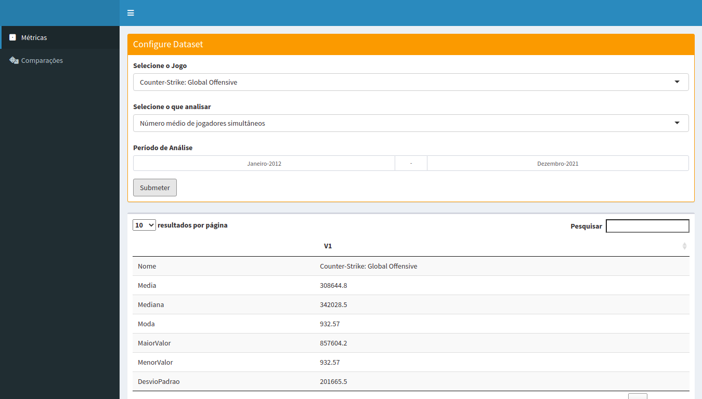

# Projeto 2

Projeto 2 da discipla de Estatística e Probabilidade para Computação (et586)

## Bibliotecas Usadas
- shiny
- shinydashboard
- magrittr
- lubridate

## Como Instalar
É preciso ter o interpretador da linguagem R instalado com todas as bibliotecas listadas acima. Elas podem ser instaladas rodando o comando a baixo no interpretador
```r
   install.packages(<nome_da_biblioteca>)
```

Tendo o interpretador pronto e o repositório clonado, abra o diretório raiz no terminal e execute:
```bash
   R -f app.R
```

## TODO
- [x] Adicionar input para classe a ser analisada
- [x] Adicionar intervalo de datas da análise
- [x] Adicionar uma tabela contendo:
   - [x] média 
   - [x] mediana
   - [x] moda
   - [x] desvio padrão
   - [x] valor máximo na série
   - [x] valor mínimo na série
- [ ] Adicionar histograma da série
- [ ] Adicionar boxplot da série
- [x] Adicionar segunda aba com:
   - [ ] duas classes a serem analisadas
   - [ ] intervalo de datas para a análise
   - [ ] uma tabela com o valor da correlação entre as classes
   - [ ] gráfico de linha das classes
   - [ ] gráfico em barra das médias de cada classe
   - [ ] scatterplot das classes 
